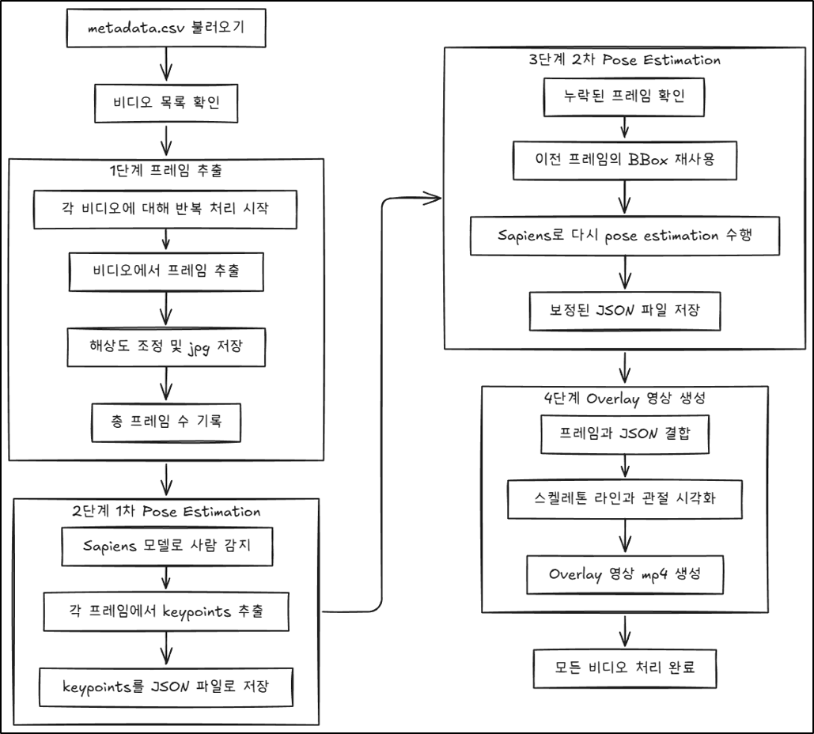

# 🦴 Sapiens Video Pose Estimation Pipeline

본 프로젝트는 **Sapiens** 모델을 활용하여 대규모 비디오 데이터셋에서 **2D Keypoints**를 추출하고, 시각화(Overlay) 영상을 자동으로 생성하는 파이프라인입니다.

`metadata.csv` 파일을 통해 전체 데이터 처리가 관리되며, **RTMDet**(사람 검출)과 **Sapiens**(포즈 추정)를 결합하여 높은 정확도를 보장합니다. **Docker** 및 **Slurm** 환경에서 대규모 병렬 처리가 가능하도록 최적화되어 있습니다.

---

## ✨ Key Features

* **🔄 Automated Pipeline:** 비디오 입력부터 전처리(Frame), 추론(Inference), 보정(Correction), 시각화(Rendering)까지 원스톱 자동화.
* **🧠 High-Fidelity Models:**
    * **Detector:** RTMDet (m, coco-person)
    * **Pose Estimator:** Sapiens-0.3b (High resolution 1024x768)
* **🛡️ Robustness:** Keypoints 감지 실패 시 인접 프레임의 정보를 활용하여 강제로 재추론하는 **Re-extraction** 기능 탑재.
* **🐳 Reproducibility:** Docker 컨테이너 기반으로 언제 어디서든 일관된 실행 환경 제공.

---

## 📂 Project Structure

```text
.
├── 0_run_sapiens.sh            # Slurm Job 제출 스크립트 (Entrypoint)
├── runner/
│   └── sapiens_pipeline.py     # 전체 파이프라인 제어 메인 스크립트
├── functions/                  # 핵심 기능 모듈 (Step 1~4)
│   ├── extract_frames.py             
│   ├── extract_keypoints.py          
│   ├── reextract_missing_keypoints.py
│   └── render_skeleton_video.py      
├── configs/                    # Model Config Files (MMPose/MMDet)
│   ├── detector/rtmdet_m_640-8xb32_coco-person_no_nms.py
│   └── sapiens/sapiens_0.3b-210e_coco-1024x768.py
├── docker/                     # Docker 환경 설정
│   ├── Dockerfile
│   └── requirements.txt
└── functions/constants_skeleton/ # 시각화 상수 (Color, Links)
```

---

## 🛠️ Installation & Usage

### 1. Docker Image Build

프로젝트 실행을 위한 환경을 Docker 이미지로 빌드합니다.

```bash
# [이미지_이름]을 적절하게 변경하여 사용
docker build -t tojihoo/repetition-counter-sapiens -f ./docker/Dockerfile .
```

### 2. Data Preparation

파이프라인 실행 전, 다음을 준비해야 합니다.

1.  **비디오 파일:** 처리할 비디오 파일들을 준비합니다.
2.  **메타데이터:** 비디오 파일의 경로와 상태를 기록할 `new_metadata.csv` 파일을 `[DATA_DIR]` 경로에 준비합니다.

### 3. Run Pipeline (Slurm)

Slurm 스케줄러를 통해 GPU 자원을 확보하고 작업을 제출합니다.

1.  **스크립트 확인:** `./0_run_sapiens.sh` 파일 내의 `DOCKER_IMAGE_NAME`, `WORKSPACE_PATH` 및 GPU 자원 (`#SBATCH`) 설정을 환경에 맞게 수정합니다.
2.  **작업 제출:**
    ```bash
    sbatch ./0_run_sapiens.sh
    ```

---

## ⚙️ Pipeline Steps

  

`runner/sapiens_pipeline.py`는 각 비디오에 대해 다음 4단계를 순차적으로 수행하며, 결과물은 **RAW DATA** 내부 파일 경로와 동일한 구조로 `[DATA_DIR]`에 저장됩니다.

| Step | Module | Description | Output Path |
| :--- | :--- | :--- | :--- |
| **1. Frame Extraction** | `functions/extract_frames.py` | 비디오를 읽어 `.jpg` 이미지 시퀀스로 변환합니다. | `[DATA_DIR]/1_FRAME/` |
| **2. Keypoints Inference** | `functions/extract_keypoints.py` | RTMDet 검출 및 Sapiens 모델로 2D Keypoints를 추출합니다. | `[DATA_DIR]/2_KEYPOINTS/` |
| **3. Missing Correction** | `functions/reextract_missing_keypoints.py` | Step 2에서 누락된 프레임을 인접 BBox를 활용하여 재추론합니다. | `[DATA_DIR]/2_KEYPOINTS/` |
| **4. Skeleton Visualization** | `functions/render_skeleton_video.py` | 원본 프레임 위에 추출된 Skeleton을 오버레이하여 검증용 MP4 영상을 생성합니다. | `[DATA_DIR]/3_MP4/` |

---

## 📝 License

This project is based on [OpenMMLab](https://github.com/open-mmlab) and [Sapiens](https://github.com/facebookresearch/sapiens).